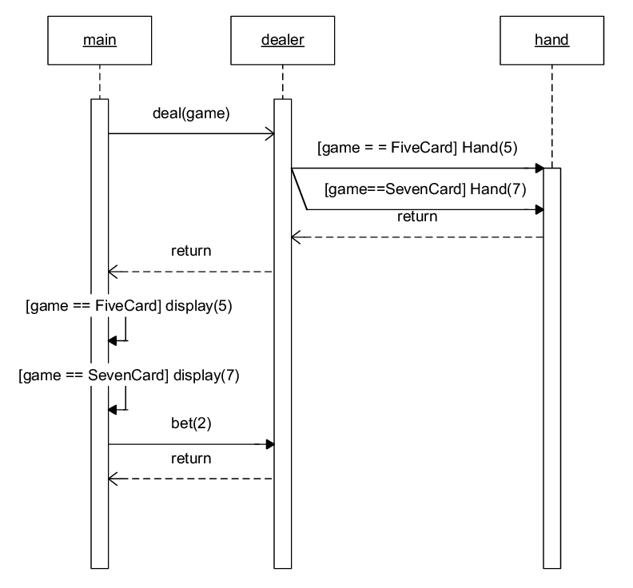

*Brief description of your discussions within your team so far, and any current candidate ideas for your project. You should talk with your TA/Alex/Caroline as soon as possible about these ideas; due to the project starting mid-week it's OK if you have not yet done this, but make sure to note the progress you have made so far. Any planned follow-up tasks for the next week.*

So far we have discussed two potential ideas for our project 2. Both of these projects will be satisfying requirements 2 and 3 of the project.

**Monitor Stack Allocation**
- Map functions to their stack allocations
- Display a chart or bar graph or something that shows the size/location of their stack allocations (not static but would work on C or C++ so would meet req. 2 and 3)
- Find libraries that look at the call stack (or similar)
- Research other dynamic analysis tools in C++

**Visualizing Execution workflow for Java.**
- We were thinking of generating an output similar to the sequence diagrams from CPSC210.
- 
- Time spent on each function, number of calls
- Some potential relevant libraries: javaparser, graphviz, BTrace

*Any planned follow-up tasks for the next week.*

Based on discussions with our TA Madonna, we will be researching libraries and frameworks mentioned in the shared class [google doc](https://docs.google.com/document/d/1NADVQ4aqwoTfCv7ajVWa0dFxXJAGMKoVMVtgxaF0gWw/edit) to do our own program analysis. We will also plan to meet and discuss the distribution of tasks for the next project.
