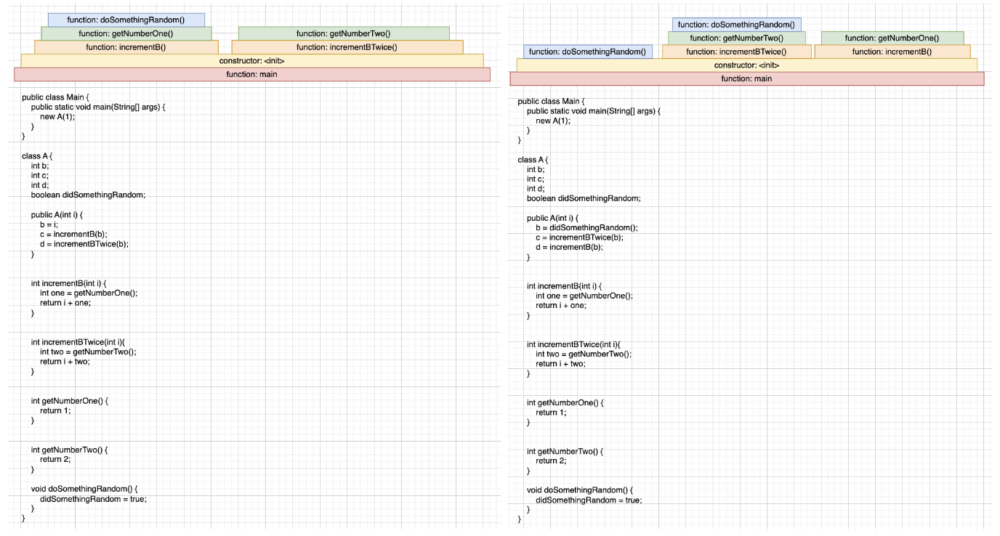

### Group 16 Project 2 Check-in 4
Status of implementation so far:
* From our last check in, we received feedback that our initial project idea was too simple. We are planning to change our project scope to be a Java profiler that allows the user to see the runtime of the execution path, and identify any hotpots in the code as well as areas that are not as frequently caught in the code. This would allow the user to see which part of their code runs efficiently, and which parts of the code vary in runtime whenever the program is executed. Currently, we are doing research and tutorials to learn and understand Java Instrumentation vs. Java Parser. We are leaning towards using Java Parser as that allows us to dig into the AST, whereas Java Instrumentation may require us to go into the byte code. We are continuing our research to compare Java Parser against other tools that could be useful for our project.
Hopefully, by our TA meeting next week, we’ll be comfortable enough with the Java Implementation API to ask any clarifying questions needed.

Plans for final user study:
* A potential idea for the final user study was to recruit someone familiar with programming, and get them to run a program using our analysis tool. This could be a program that is basic enough that we can briefly explain what it does. We would collect feedback based on their response to the functionality and visualization of our analysis tool.

Planned timeline for the remaining days. (Adapted from Check-In 2):\
* Mar 29th:\
Basic implementation of modules done (basic usage of Java Instrumentation, Visualization module)\
Final user study plan\
User study improvements to codebase

* April 5th:\
Have the initial version of end-to-end product done\
Film/upload video

Progress against the timeline planned for your team, including the specific goals you defined (originally as part of Check-in 2) for Check-in 4; any revisions to Check-in 5 goals.

* Originally, our goal for this week was to finalize the data points that we needed to collect. However, since our project scope has changed, this is no longer relevant. Revisions to check-in 5 goals are made above under Mar. 29.

### Group 16 Project 2 Check-in 3

*Updates for Check-in 3*

Due to the feedback received from our TA, we had to change our project idea. Our idea now is to build a program analysis tool that will measure the runtime of every function call as the program runs, and it will also display the flow of the program from beginning to end. We plan to use dynamic analysis and have a visualization component (likely a flame graph) to display our work to the user.

Our target users for this project are those who are interested in determining areas of the code where its runtime can be improved, and pick up on parts of the code that are not reachable. This is ideal for users looking to refactor parts of their project, and it should be suitable for projects at all levels of complexity (i.e. student project, professional legacy code).

We are still on track with our timeline, though we may be slightly behind due to the sudden change of our plans. We have to look into new frameworks/libraries that work with our new idea for Project 2, so the preparation to begin implementing the project may be delayed.

_User Study 1_

We completed the user study by presenting the following two flame diagram mockups to the participant and asking him to provide us with feedback about both the use case and interpretability of the visualizations.

We received the following feedback and discussed the respective solutions for each:

Feedback: Tree structure might make more sense
Solution: Keeping the block structure for better responsiveness

Feedback: If multiple calls of the same function, then make separate blocks
Solution: This will be included in our implementation

Feedback: What is the order when the function calls multiple things?
Solution: The order will be implemented from left to right.

Feedback: How does the graph handle recursion?
Solution: We will consider have the same function stacked on top of itself.

Feedback: How realistic is it or interpretable if it becomes too complex for codebases in industry? Maybe good for teaching
Solution: The use case will have to be reduced to either a small portion of the code base or for education purposes.

Feedback: Do the different colours symbolize anything?
Solution: We can consider correlating the colours to the length of time it takes to run.

Feedback: What does the size of the bars mean?
Solution: We can make the size of the bars correlate to the length of time it takes to run.

### Group 16 Project 2 Check-in 2A

*Brief description of your planned program analysis (and visualization, if applicable) ideas.*

Static analysis of code to measure level of coupling between classes in Java. Would assign a coupling score between each class and display results as a matrix showing relation of all classes to all other classes. Users would be developers learning about coupling in object oriented programs and developers being introduced to new code bases to get an overview of how classes interact. The visualization of our results would come in the form of a graph, table or something similar.

*Notes of any important changes/feedback from TA discussion.*

Our TA provided useful feedback which included reducing the scope of our original implementation and having us decide on which of the 3 requirements to implement. We were also encouraged to think of a more specific use case and user for our program analysis. 

*Any planned follow-up tasks or features still to design*

We plan to do more program analysis review so that we can clearly define the roadmap next week and do a proper breakdown of responsibilities.

*Planned division of main responsibilities between team members*

Here is our rough breakdown of tasks. We will have more clarity on exacts tasks as the weeks progress.

1. Visualization Component (if required) (Sophia, Will)
- Endpoint/Data handoff
- Data model
- View model

2. Java Program Analysis (Jeffrey, Taylor, Dave)
- Static Analysis
- Dynamic Analysis

*Summary of progress so far.*

Decided that Java will be the language we will analyze. We made a rough outline of tasks for the upcoming weeks. We have also split up modules of the program.

*Roadmap / Timeline*

Mar 15th
- Review the libraries for Java AST
- Brainstorm potential data points to collect
- Complete draft of user study

Mar 22nd
- Finalize data points to collect

Mar 29th
- Final user study plan
- Bug fixes
- User study improvements to codebase

April 5th
- Have the initial version of end-to-end product done
- Film/Edit video

Project 2 Deadline (April 8th 2024)
- Completed Video

### Group 16 Project 2 Check-in 1

*Brief description of your discussions within your team so far, and any current candidate ideas for your project. You should talk with your TA/Alex/Caroline as soon as possible about these ideas; due to the project starting mid-week it's OK if you have not yet done this, but make sure to note the progress you have made so far. Any planned follow-up tasks for the next week.*

So far we have discussed two potential ideas for our project 2. Both of these projects will be satisfying requirements 2 and 3 of the project.

**Monitor Stack Allocation**
- Map functions to their stack allocations
- Display a chart or bar graph or something that shows the size/location of their stack allocations (not static but would work on C or C++ so would meet req. 2 and 3)
- Find libraries that look at the call stack (or similar)
- Research other dynamic analysis tools in C++

**Visualizing Execution workflow for Java.**
- We were thinking of generating an output similar to the sequence diagrams from CPSC210.
- 
- Time spent on each function, number of calls
- Some potential relevant libraries: javaparser, graphviz, BTrace

*Any planned follow-up tasks for the next week.*

Based on discussions with our TA Madonna, we will be researching libraries and frameworks mentioned in the shared class [google doc](https://docs.google.com/document/d/1NADVQ4aqwoTfCv7ajVWa0dFxXJAGMKoVMVtgxaF0gWw/edit) to do our own program analysis. We will also plan to meet and discuss the distribution of tasks for the next project.
